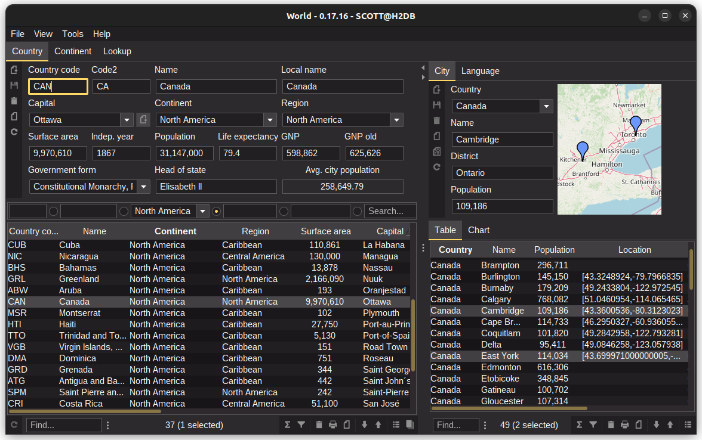

= Codion World Demo

A demo application based on the https://codion.is[Codion application framework].

== Documentation

Build the tutorial by running this Gradle target:

[source,shell]
----
gradlew documentation:asciidoctor
----

...and browse the tutorial here:

[source]
----
documentation/build/docs/asciidoc/world.html
----

== Modules

Many of the following modules are configuration-only, that is, contain no source-code, just Gradle build files configuring the application for running and packaging.

=== world-domain-api

The domain model API.

=== world-domain

The domain model implementation.

=== world-client

Swing client application.

=== world-client-local

Configuration only. Swing client configured with a local JDBC connection.

==== Run

[source,shell]
----
gradlew world-client-local:run
----

NOTE: The client runs with an in-memory H2 database, created on startup, so changes to data do not persist.

==== Package

[source,shell]
----
gradlew world-client-local:jlink
gradlew world-client-local:jpackage
----

=== world-client-http

Configuration only. Swing client configured with a HTTP connection.

==== Run

NOTE: The server must be running

[source,shell]
----
gradlew world-client-http:run
----

==== Package

[source,shell]
----
gradlew world-client-http:jlink
gradlew world-client-http:jpackage
----

=== world-client-remote

Configuration only. Swing client configured with a RMI connection.

==== Run

NOTE: The server must be running

[source,shell]
----
gradlew world-client-remote:run
----

==== Package

[source,shell]
----
gradlew world-client-remote:jlink
gradlew world-client-remote:jpackage
----

=== world-server

Configuration only. A Codion server configured for the world application.

NOTE: The server runs with an in-memory H2 database, created on startup, so changes to data do not persist.

==== Configuration

The server host name and ports are configured in *gradle.properties*.

[source,shell]
----
serverHost=localhost
serverPort=2223
serverRegistryPort=1098
serverHttpPort=8081
serverAdminPort=4445
----

==== Run

[source,shell]
----
gradlew world-server:run
----

==== Package

[source,shell]
----
gradlew world-server:jlink
gradlew world-server:jpackage
----

=== world-server-monitor

Configuration only. A Codion server monitor configured for the server.

==== Run

[source,shell]
----
gradlew world-server-monitor:run
----

==== Package

[source,shell]
----
gradlew world-server-monitor:jlink
gradlew world-server-monitor:jpackage
----